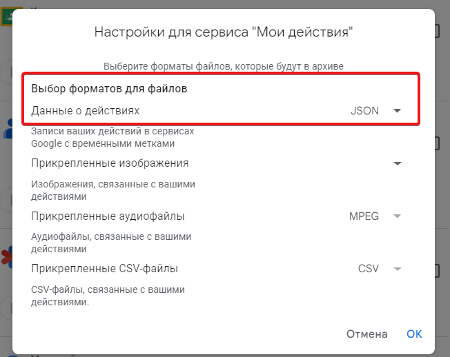
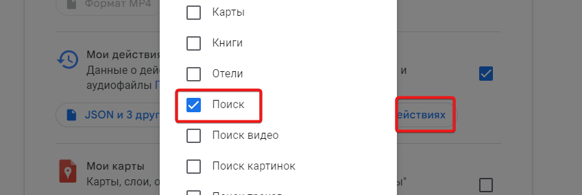

# Google Takeout Search Statistics

A Python application to analyze and visualize your Google search history from Google Takeout data.

## Features

- Import search history from Google Takeout
- Visualize search patterns over time
- Filter and analyze search history
- Export statistics and reports

## Getting Started

### Prerequisites

- Python 3.8+
- Required Python packages (install via `pip install -r requirements.txt`)

### Installation

1. Clone the repository:
   ```bash
   git clone https://github.com/yourusername/google-takeout-search-stats.git
   cd google-takeout-search-stats
   ```

2. Install the required packages:
   ```bash
   pip install -r requirements.txt
   ```

## Usage

Go to https://takeout.google.com/

Select "My activity".

In "My activity" select Format JSON.



In "My activity" select "Search".



Click "Next", wait for the process to finish.

Save `Takeout` directory to `data` directory.

Run `python app.py`.
